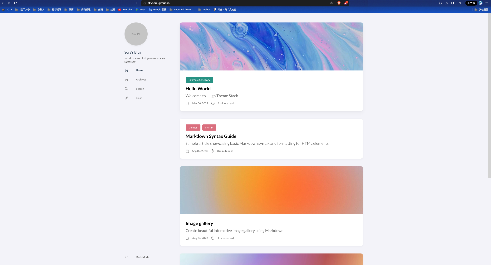
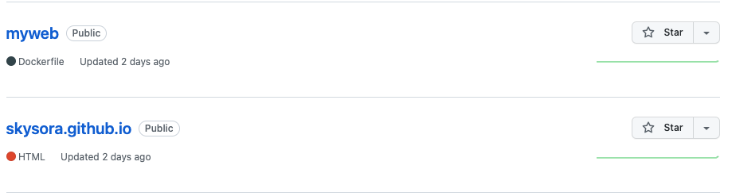
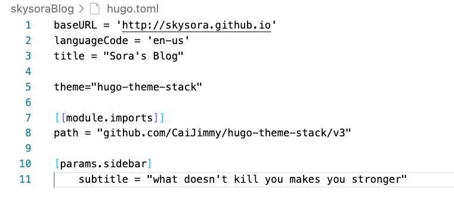

#  利用Hugo建置靜態網頁放置在Github server上

## 結果圖


### 1.事前軟體安裝
*  Git
*  Hugo

### 2.在Github上創立兩個Repositories
兩個Repositories分別代表
*  [YourwebName] : 放置Hugo code
*  [GithubUserName].github.io: 放置Hugo產生出來的靜態網頁


### 3.將兩個Repositories clone 下來並初始化hugo folder

```bash

    git clone https://github.com/skysora/myweb.git
    cd myweb
    hugo new site [yourNeedName]
    git clone https://github.com/skysora/skysora.github.io.git

```

### 4.將想要的模板git clone 到 /themes目錄下

可以去[官方網站](https://themes.gohugo.io/)挑模板

```bash

    cd themes
    git clone https://github.com/CaiJimmy/hugo-theme-stack-starter
    
```
* 注意，若要載hugo-theme-stack-starter模組要另外載mod

```bash

    hugo mod get -u github.com/CaiJimmy/hugo-theme-stack/v3
    hugo mod tidy
    
```
### 5.將hugo.toml 設定檔案做修正
* 修正baseURL 為你的github網址(baseURL)
* 將theme修正為你clone模板名稱(theme)
* import 模組



### 6.產生靜態網頁

* 先將[GithubUserName].github.io Repositories clone 進[yourNeedName] 資料夾
* 將hugo code 轉成靜態網頁

```bash

    git submodule add -b main https://github.com/skysora/skysora.github.io.git public
    hugo -t hugo-theme-stack
    
```

### 7.將靜態網頁部署上去

```bash

    cd public
    git add -A
    git commit -m "first commit"
    
```

> — <cite>Creating a Blog with Hugo and Github in 10 minutes[^1]</cite>

[^1]:https://www.youtube.com/watch?v=LIFvgrRxdt4