## 活動計畫

### 活動目標

由於實驗室畢業時長不固定，每屆學生沒辦法估算自己什麼時候可以拍畢業照，導致三四屆都沒有拍到值得紀念的照片，所以利用這次機會將過去幾屆學長邀請回實驗室一起拍照，總共有兩個活動。

-   1.實驗室聚餐(2023年畢業學生合資的謝師宴)

-   2.碩士服拍攝

### 基本內容

#### 日期

-   2023-11-8
#### 時間

- 實驗室聚餐:12:00
- 碩士服拍攝:15:00
#### 地點

- 實驗室聚餐:三創高麗園
- 碩士服拍攝:臺灣科技大學自然語言實驗室

## 事前規劃

### 人員邀請
- 確認每個人的時間表，尤其是已畢業人員
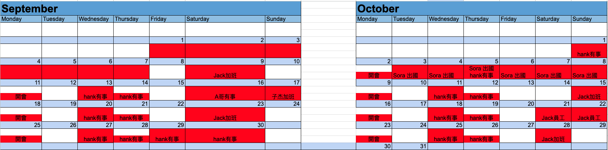

### 金流
- 利用excel登記參與人員和金流，能先收到錢的先收，付款時由一個人統一付款(能領信用款回饋)
- 若是需要押金(大筆)可以找有工作的學長看能不能先墊付(碩士服押金)
- 為了節約碩士服成本，可至校版租看看，利用比較便宜價格租借(租借人員也要登記)

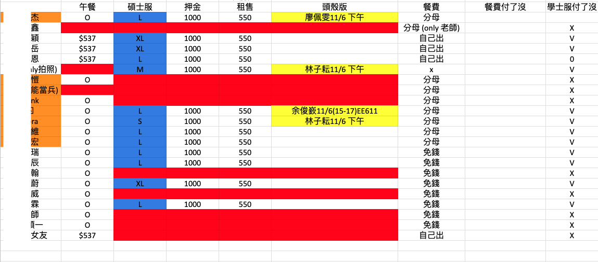 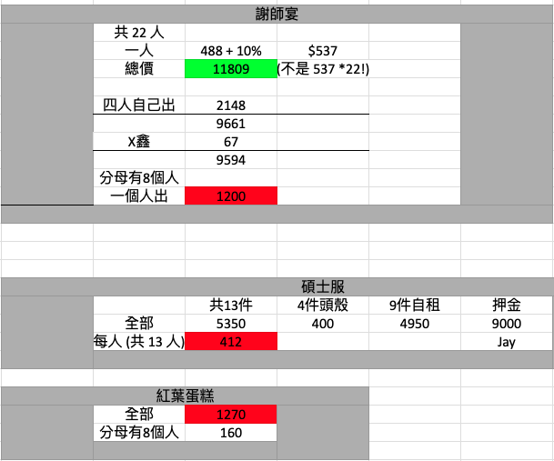

### 前一天提醒

 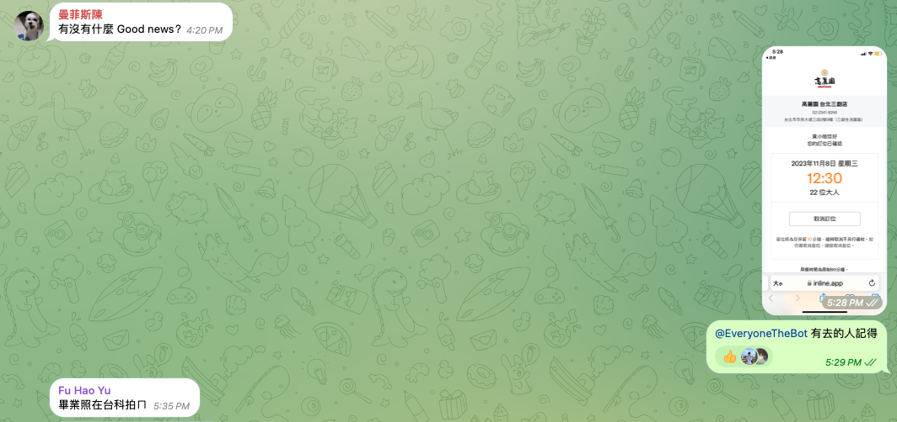

## 活動當天

### 畢業生個人禮物
 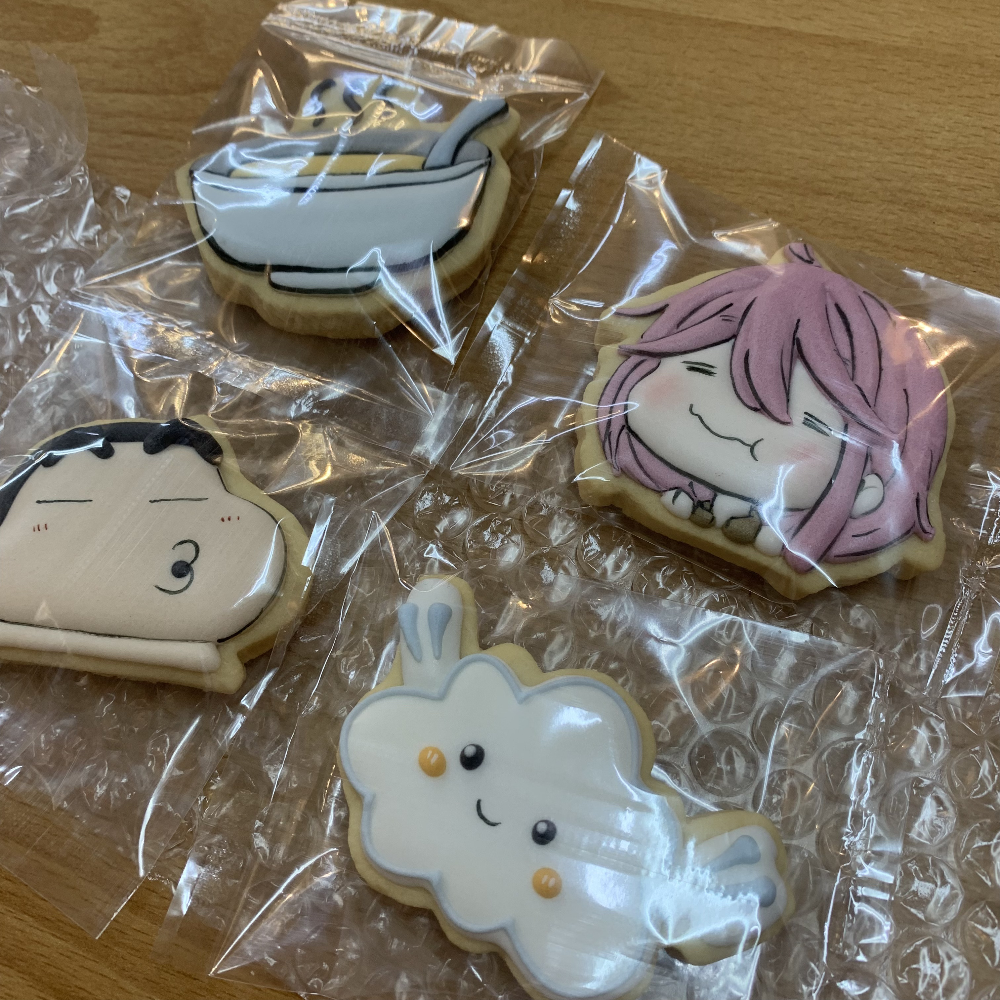

### 慶生

 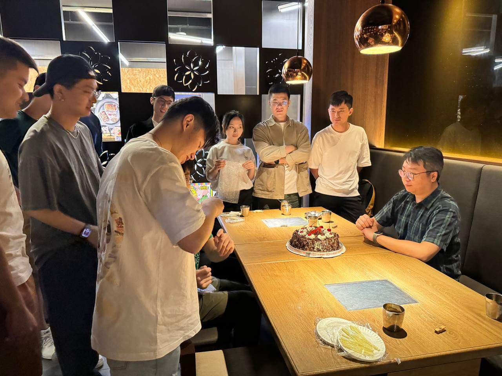  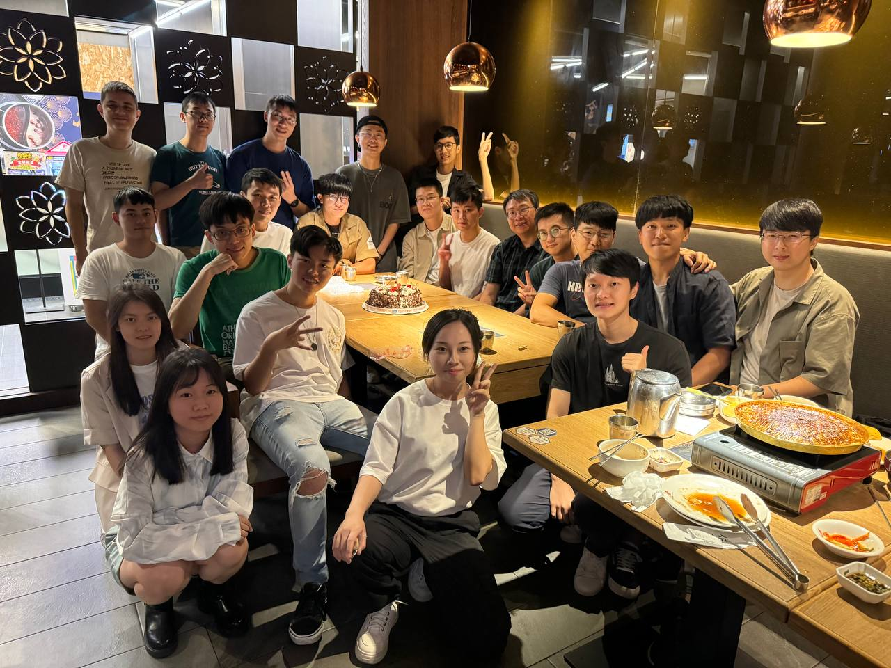

### 聚餐結束回實驗室換裝

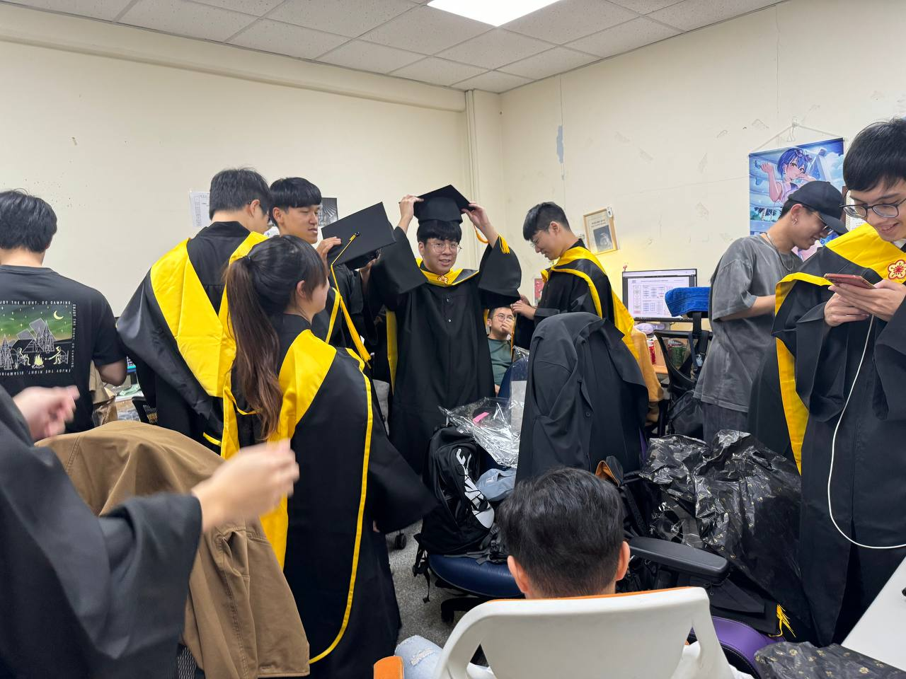

### 大合照

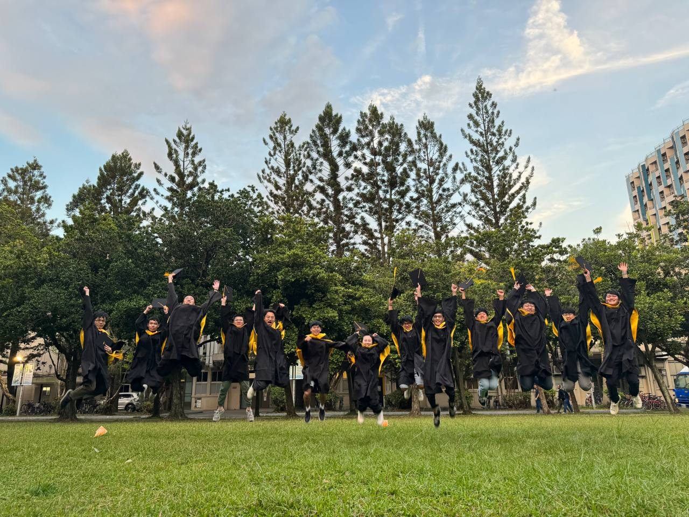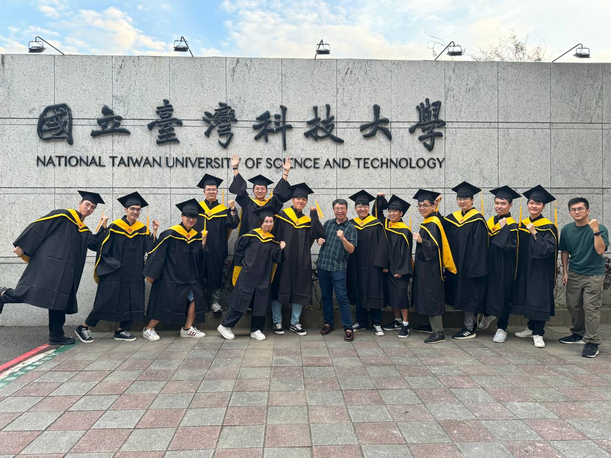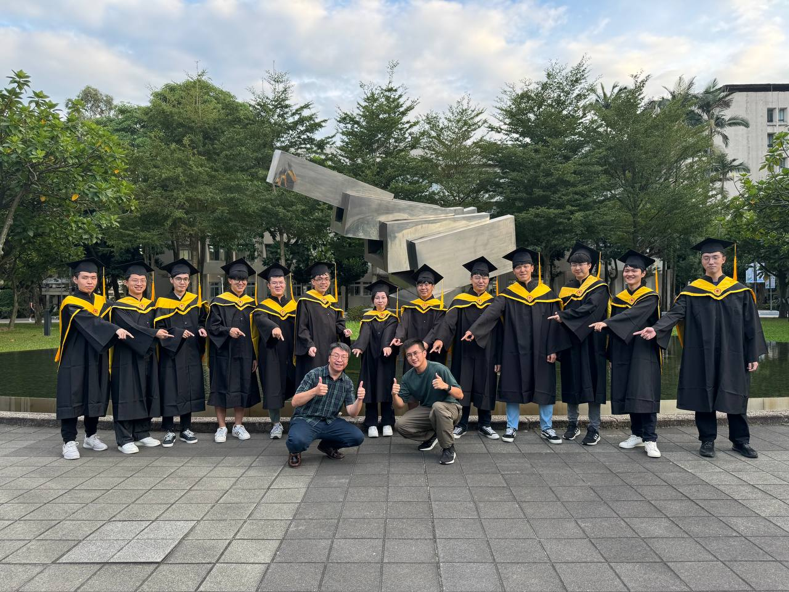

### 同屆拍照

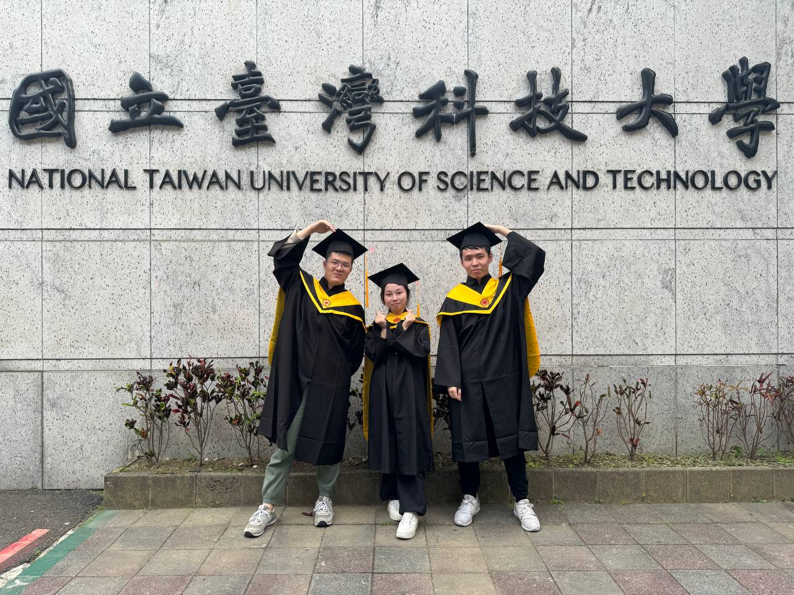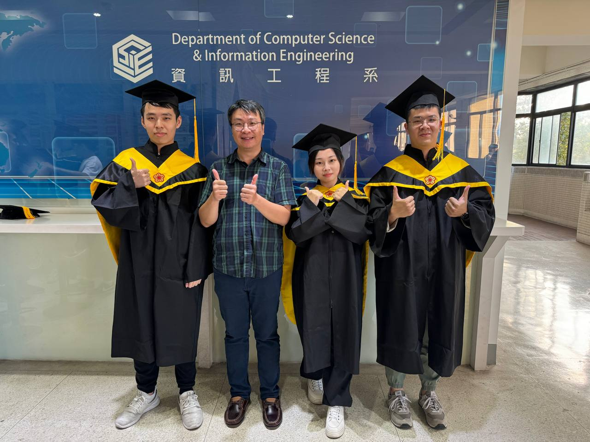

## 後記

### 歸還物品

- 在期限內歸還物品

### 檢討

- 拍照要趁有陽光的時候拍，所以不能放人去逛街

### 感謝

- 特別感謝hgvf幫忙算錢、Jack學長幫忙代墊碩士服押金、Johnn9學弟幫忙去取蛋糕。
- 感謝Jack女友、Paul學弟和mango學弟幫忙拍照

