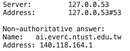
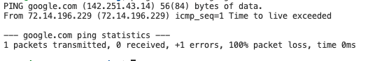

## 結果

- 能將憑證掛載至DNS上利用https進入


## 步驟1:確認DNS可用
- 參考[文章](https://blog.pulipuli.info/2023/04/blog-post_09.html)
### 檢查域名是否真的註冊

``` bash

    apt-get install -y dnsutils
    nslookup <your_dns>
-
```

- 成功結果



- 失敗會顯示** server can't find not-registered.pulipuli.info: NXDOMAIN

### 確認伺服器的網路是否可連線

``` bash

    apt-get install -y iputils-ping
    ping -c 1 -t 10  <your_dns>
-
```

- 成功結果



- 失敗會顯示ping: not-registered.google.com: Name or service not known


### 檢查伺服器的HTTP服務是否正在運作

- 進行第二步驟前要先確認HTTP是否能使用。
- 可先架設基本nginx網站，後續我們也會借此認證憑證

#### 下載nginx

```bash

sudo apt update
sudo apt install nginx
sudo systemctl start nginx

```

#### 檢查網站是否正常運作

    - 直接到瀏覽器前往DNS，成功會顯示網頁，失敗會顯示Not Found。


## 步驟2:利用certbot申請憑證

    - 要先確認HTTP是否可以正常運作

### 利用nginx認證憑證公鑰及私鑰

- 一般來說/var/www/html為nginx網頁根目錄
- 產生後檔案複製到flask(或其他)資料夾內

``` bash 

    sudo certbot certonly --webroot -w /var/www/html -d <your_dns>
-
```

### 設定金鑰路徑(使用gevent)

- 這裡是使用gunicorn python套件幫忙執行flask服務，所以編輯gunicorn設定檔
- 詳細gunicorn架設服務教學可參考[Flask登入註冊專案](https://skysora.github.io/post/7/)
- 設定完成後就可以以https連線囉
- 要注意設定port號，基本https是443
gunicorn.conf.py
```python 
    workers = 5
    worker_class = "gevent"   
    bind = "0.0.0.0:443"

    certfile = "/web/ssl/fullchain.pem"  # SSL 证书的路径
    keyfile = "/web/ssl/privkey.pem"   # SSL 私钥的路径
-
```

