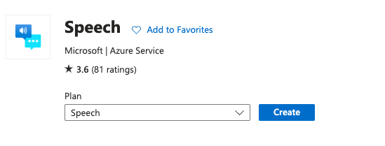
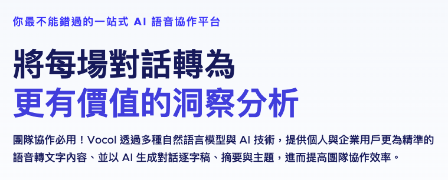

#  


## 結論

### Inline Markdown within tables

功能| Azure   | GCP     | AWS   | Vocol   |
--------| --------  | -------- | ------ |------ |
服務名稱   | Speech | Cloud Speech-to-Text API | Amazon Transcribe | vovol.ai   |
GUI介面 | X | O | O |  O  |
輸出多元度 | 高 | 普 | 普 |  低  |
切割單位 | 整段、句子 | 句子、字 | 整段、詞 |  說話者  |
調整設定 | 無 | 普 | 最多 |  少  |

### Azure

* 優點：回傳的比較詳細
* 缺點：沒有GUI介面，要自己刻
* 可以簡單利用API串接的方式達到即時麥克風輸入、語音上傳的功能，但是如果要進行較大檔案的上傳，利用官方網站提供的Sample code無法執行，要另外自行串接
* 輸出格式：大致如下，combinedRecognizedPhrases為辨識出的每個句子組合的文章，recognizedPhrases則包含每個辨識出來的句子詳細資料。
```json

    {
        "source":"https://ntuststorage1.blob.core.windows.net/test/1.wav",
        "timestamp":"2023-09-18T14:06:32Z",
        "durationInTicks":6875900000,
        "duration":"PT11M27.59S",
        "combinedRecognizedPhrases":[...],
        "recognizedPhrases"[...],
    }

```
*   
    Property | Description  | 
    --------| --------  | 
    Lexical| The lexical form of the recognized text: the actual words recognized.   | 
    ITN   | The inverse-text-normalized (ITN) or canonical form of the recognized text, with phone numbers, numbers, abbreviations ("doctor smith" to "dr smith"), and other transformations applied. | 
    MaskedITN   | The ITN form with profanity masking applied, if requested. | 
    Display   | The display form of the recognized text, with punctuation and capitalization added. This parameter is the same as what DisplayText provides when the format is set to simple. | 
```json

    "combinedRecognizedPhrases":[
        {
            "channel":0,
            "lexical":"台 湾 民 主 国 的 抗 日 这 是 什 么 呢 蓝 色 的 底 色 黄 色 的 老 虎 蓝 地 黄 虎 旗 是 什 么 国 家 的 旗 帜 台 湾 民 主 国 台 湾 民 主 国 蓝 地 黄 虎 旗 与 清 朝 黄 龙 起 有 何 不 同 呢 颜 色 相 反 龙 虎 相 斗 还 是 龙 兄 虎 弟 台 湾 民 主 国 什 么 时 候 成 立 的 呢 目 的 是 什 么 总 统 是 谁 结 果 又 如 何 呢 西 元 一 八 九 四 年 中 国 清 廷 与 日 本 因 为 朝 鲜 问 题 爆 发 什 么 战 争 西 元 一 八 九 四 年 清 光 绪 二 十 年 中 国 清 廷 与 日 本 ",
            "itn":"台 湾 民 主 国 的 抗 日 这 是 什 么 呢 蓝 色 的 底 色 黄 色 的 老 虎 蓝 地 黄 虎 旗 是 什 么 国 家 的 旗 帜 台 湾 民 主 国 台 湾 民 主 国 蓝 地 黄 虎 旗 与 清 朝 黄 龙 起 有 何 不 同 呢 颜 色 相 反 龙 虎 相 斗 还 是 龙 兄 虎 弟 台 湾 民 主 国 什 么 时 候 成 立 的 呢 目 的 是 什 么 总 统 是 谁 结 果 又 如 何 呢 西 元 1894年 中 国 清 廷 与 日 本 因 为 朝 鲜 问 题 爆 发 什 么 战 争 西 元 1894年 清 光 绪 二十 年 中 国 清 廷 与 日 本 因 为 朝 鲜 问 题 爆 发 甲 午",
            "maskedITN":"台湾民主国的抗日这是什么呢蓝色的底色黄色的老虎蓝地黄虎旗是什么国家的旗帜台湾民主国台湾民主国蓝地黄虎旗 关甲午战争西元1895年6月日军进入哪里就宣布开始统治台湾 台北",
            "display":"台湾民主国的抗日，这是什么呢？蓝色的底色，黄色的老虎蓝地黄虎旗是什么国家的旗帜？台湾民主国台湾民主国蓝地黄虎旗。 与清朝黄龙起有何不同呢？颜色相反，龙虎相斗，还是龙兄虎弟，台湾民主国什么时候成立的呢？目的是什么？总统是谁？结果又如何呢？ 西元1894年，中国清廷与日本因为朝鲜问题爆发什么战争？西元1894年清光绪二十年，中国清廷与日本因为朝鲜问题爆发甲午战争，中国的海战陆战都。 都失败，所以清廷派李鸿章到日本求和在下关也就是马关的谈判当"
        },
        {
            "channel":1,
            "lexical":"台 湾 民 主 国 的 抗 日 这 是 什 么 呢 蓝 色 的 底 色 黄 色 的 老 虎 蓝 地 黄 虎 旗 是 什 么 国 家 的 旗 帜 台 湾 民 主 国 台 湾 民 主 国 蓝 地 黄 虎 旗 与 清 朝 黄 龙 起 有 何 不 同 呢 颜 色 相 反 龙 虎 相 斗 还 是 龙 生 虎 地 台 湾 民 主 国 什 么 时 候 成 立 的 呢 目...",
            "itn":"台 湾 民 主 国 的 抗 日 这 是 什 么 呢 蓝 色 的 底 色 黄 色 的 老 虎 蓝 地 黄 虎 旗 是...",
            "maskedITN":"台湾民主国的抗日这是什么呢...",
            "display":"台湾民主国的抗日，..."
        }
    ],

```
* 這裡是回傳5-best
Property | Description  | 
--------| --------  | 
Confidence| The confidence score of the entry, from 0.0 (no confidence) to 1.0 (full confidence).   | 


```json

    "recognizedPhrases":[
      {
         "recognitionStatus":"Success",
         "channel":0,
         "offset":"PT0.64S",
         "duration":"PT28.04S",
         "offsetInTicks":6400000.0,
         "durationInTicks":280400000.0,
         "nBest":[
            {
               "confidence":0.8839353,
               "lexical":"台 湾 民 主 国 的 抗 日 这 是 什 么 呢 蓝 色 的 底 色 黄 色 的 老 虎 蓝 地 黄 虎 旗 是 什 么 国 家 的 旗 帜 台 湾 民 主 国 台 湾 民 主 国 蓝 地 黄 虎 旗",
               "itn":"台 湾 民 主 国 的 抗 日 这 是 什 么 呢 蓝 色 的 底 色 黄 色 的 老 虎 蓝 地 黄 虎 旗 是 什 么 国 家 的 旗 帜 台 湾 民 主 国 台 湾 民 主 国 蓝 地 黄 虎 旗",
               "maskedITN":"台湾民主国的抗日这是什么呢蓝色的底色黄色的老虎蓝地黄虎旗是什么国家的旗帜台湾民主国台湾民主国蓝地黄虎旗",
               "display":"台湾民主国的抗日，这是什么呢？蓝色的底色，黄色的老虎蓝地黄虎旗是什么国家的旗帜？台湾民主国台湾民主国蓝地黄虎旗。"
            },
            {
               "confidence":0.8823599,
               "lexical":"台湾民主国的抗日这是什么呢蓝色的底色黄色的老虎蓝帝黄虎旗是什么国家的旗帜台湾民主国台湾民主国蓝帝黄虎旗",
               "itn":"台湾民主国的抗日这是什么呢蓝色的底色黄色的老虎蓝帝黄虎旗是什么国家的旗帜台湾民主国台湾民主国蓝帝黄虎旗",
               "maskedITN":"台湾民主国的抗日这是什么呢蓝色的底色黄色的老虎蓝帝黄虎旗是什么国家的旗帜台湾民主国台湾民主国蓝帝黄虎旗",
               "display":"台湾民主国的抗日这是什么呢蓝色的底色黄色的老虎蓝帝黄虎旗是什么国家的旗帜台湾民主国台湾民主国蓝帝黄虎旗"
            }
         ]
      },
      {
         "recognitionStatus":"Success",
         "channel":0,
         "offset":"PT29.52S",
         "duration":"PT29.2S",
         "offsetInTicks":295200000.0,
         "durationInTicks":292000000.0,
         "nBest":[
            {
               "confidence":0.8856299,
               "lexical":"与 清 朝 黄 龙 起 有 何 不 同 呢 颜 色 相 反 龙 虎 相 斗 还 是 龙 兄 虎 弟 台 湾 民 主 国 什 么 时 候 成 立 的 呢 目 的 是 什 么 总 统 是 谁 结 果 又 如 何 呢",
               "itn":"与 清 朝 黄 龙 起 有 何 不 同 呢 颜 色 相 反 龙 虎 相 斗 还 是 龙 兄 虎 弟 台 湾 民 主 国 什 么 时 候 成 立 的 呢 目 的 是 什 么 总 统 是 谁 结 果 又 如 何 呢",
               "maskedITN":"与清朝黄龙起有何不同呢颜色相反龙虎相斗还是龙兄虎弟台湾民主国什么时候成立的呢目的是什么总统是谁结果又如何呢",
               "display":"与清朝黄龙起有何不同呢？颜色相反，龙虎相斗，还是龙兄虎弟，台湾民主国什么时候成立的呢？目的是什么？总统是谁？结果又如何呢？"
            },
            {
               "confidence":0.8887188,
               "lexical":"与清朝黄龙起有何不同呢颜色相反龙虎相斗还是龙生虎地台湾民主国什么时候成立的呢目的是什么总统是谁结果又如何呢",
               "itn":"与清朝黄龙起有何不同呢颜色相反龙虎相斗还是龙生虎地台湾民主国什么时候成立的呢目的是什么总统是谁结果又如何呢",
               "maskedITN":"与清朝黄龙起有何不同呢颜色相反龙虎相斗还是龙生虎地台湾民主国什么时候成立的呢目的是什么总统是谁结果又如何呢",
               "display":"与清朝黄龙起有何不同呢颜色相反龙虎相斗还是龙生虎地台湾民主国什么时候成立的呢目的是什么总统是谁结果又如何呢"
            },
         ]
      },
    ]

```
### GCP

* 優點：有GUI可以對每個設定做調整，如果沒有要接API比較方便
* 缺點：輸出feature比較少
* 輸出格式：會自行判斷斷點，以alternatives做區隔

```json

    "results":[
        {
            "alternatives":[
                {
                "transcript":" 台 灣 民 主 國 的 抗 議 , 這 是 什 麼 呢 ? 藍 色 的 底 色 , 黃 色 的 老 虎 , 藍 弟 皇 虎 旗 是 什 麼 國 家 的 期 制 ? 台 灣 民 主 國 , 台 灣 民 主 國 南 地 荒 虎 起 , 與 ,",
                "words":[
                    {
                        "word":"台"
                    },
                    {
                        "word":"灣"
                    },
                    ...
                ]
                }
            ],
            "channelTag":1,
            "languageCode":"zh-TW"
        },
        {
            "alternatives":[
                {
                "transcript":清 草 黃 龍 起 , 有 何 不 同 呢 ? 顏 色 相 反 。 龍 虎 相 鬥 , 還 是 龍 松 虎 地 ? 台 灣 民 主 國 , 什 麼 時 候 成 立 的 呢 ? 目 的 是 什 麼 ? 總 統 是 誰 ? 結 果 又 如 何 呢 ?",
                "words":[
                    {
                        "word":"清"
                    },
                    {
                        "word":"草"
                    },
                    ...
                ]
                }
            ],
            "channelTag":1,
            "languageCode":"zh-TW"
        },
    ]
```

### AWS


* 優點：有GUI可以對每個設定做調整，如果沒有要接API比較方便
* 缺點：輸出feature比較少
* 輸出格式：會自行判斷"詞"，給予信心程度、開始結束時間

```json

{
   "jobName":"2",
   "accountId":"794015217967",
   "results":{
      "transcripts":[
         {
            "transcript":"臺灣民主國的抗日，這是什麼呢？藍色的底色，黃色的老虎男的黃呼氣是什麼國家的體製臺灣民主國臺灣民主國藍的歡呼，其與清朝黃隆起有何不衕呢？顏色相反龍虎相鬥還是隆胸唬的臺灣民主國什麼時候成立的呢？目的是什麼？總統是誰，結果又如何呢？西元一八九四年中國清廷與日本因為朝鮮問題爆發什麼戰爭？西元一八九四年清光緒二十年中國青年與日本因為朝鮮問題爆髮甲午戰爭，中國的海戰、陸戰都失敗，所以輕盈派的紅妝到日本求和再下官也就是馬觀的談判噹中。日方代錶伊籐薄為予取予求，李鴻章沒有太多討價還價的餘地簽訂了割地賠款的馬關條約日本穫利豐富。..."
         }
      ],
      "items":[
         {
            "start_time":"0.65",
            "end_time":"1.05",
            "alternatives":[
               {
                  "confidence":"0.9259",
                  "content":"臺"
               }
            ],
            "type":"pronunciation"
         },
         {
            "start_time":"1.05",
            "end_time":"1.42",
            "alternatives":[
               {
                  "confidence":"0.9472",
                  "content":"灣"
               }
            ],
            "type":"pronunciation"
         },
         {
            "start_time":"1.42",
            "end_time":"2.02",
            "alternatives":[
               {
                  "confidence":"0.989",
                  "content":"民主"
               }
            ],
            "type":"pronunciation"
         },
         {
            "start_time":"2.02",
            "end_time":"2.4",
            "alternatives":[
               {
                  "confidence":"0.5566",
                  "content":"國的"
               }
            ],
            "type":"pronunciation"
         },...
      ]
   },
   "status":"COMPLETED"
}
```


### Vocol



* 優點：GUI完整。
* 缺點：可調整設定很少、沒有API可供使用
* 輸出格式：以句子做斷點。

```txt

    speaker1: 臺灣民主國的抗日。這...

    speaker2: 日軍攻佔澎湖。這...

    speaker1: 西元1895年已未年。5月29日，日軍由北百川功能九親王...

    speaker2: 中國。清朝統治臺灣。有多少年呢?...

    speaker1: 臺灣民主國雖然號稱民主，但它是否是一個民主國家呢?不是的...


```