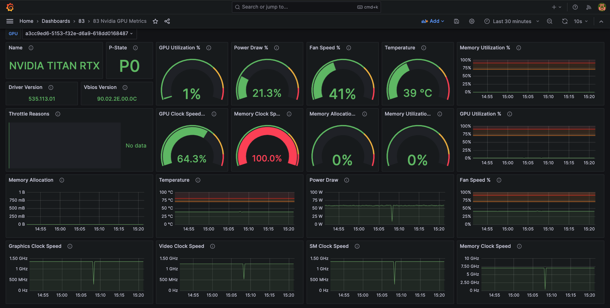
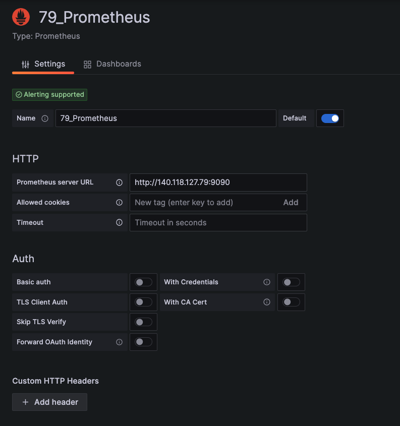
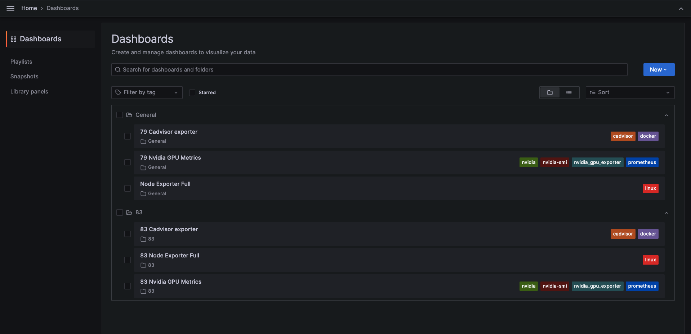

## 結果


## 架構


## 建置步驟

### 下載需要的檔案，並啟動

```bash

    git clone https://github.com/skysora/multi-server-resource-management.git
    cd multi-server-resource-management
    docker-compose up -d 

```

### 建立DataScoure

- meau->Connections->Data sources->Add new data source->prometheus
- 在Prometheus server URL，輸入<你的url>:9090 
- Save & test
- 若有多台主機要重複此步驟，並且每台主機都要經過第一步驟。



### 建立Dashboard
- 可依照喜好和使用的模組到https://grafana.com/grafana/dashboards/選擇喜歡的dashboards
- 本教學使用三個模組分別為node_exporter、cadvisor、nvidia_gpu_exporter
    - node_exporter蒐集server基本資源，Ex：CPU、Memory、Network。參考模板：https://grafana.com/grafana/dashboards/1860-node-exporter-full/
    - cadvisor 蒐集 docker容器內資源用量。參考模板：https://grafana.com/grafana/dashboards/14282-cadvisor-exporter/
    - nvidia_gpu_exporter蒐集server GPU使用量。參考模板：https://grafana.com/grafana/dashboards/14574-nvidia-gpu-metrics/
- 進入模板頁面copy dashboard ID
- Meau->Dashboards->New->Import
- 將ID 放入UID中，點選Load(Load之後會顯示另外一個ID)
- Prometheus(DataScoure)選擇資料來源
- 點擊Import


### 依照步驟2完成所有監控設定




