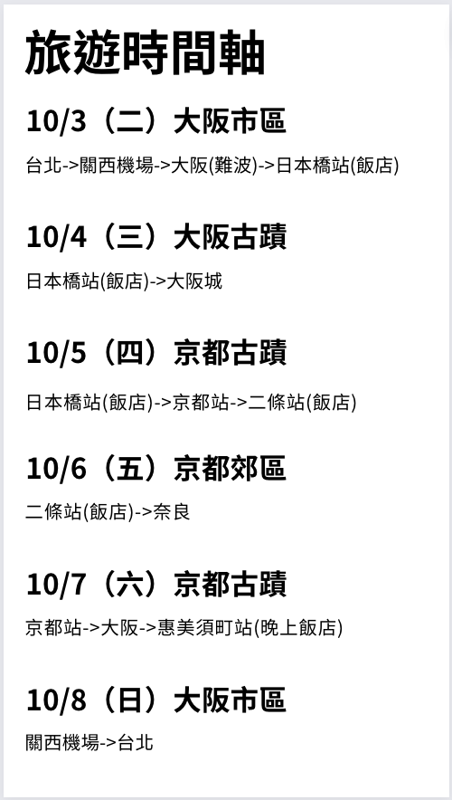
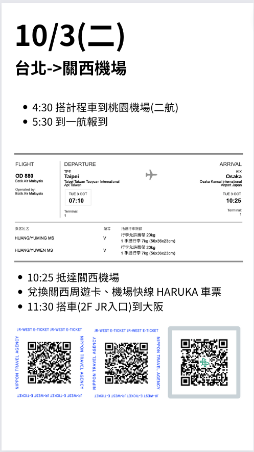
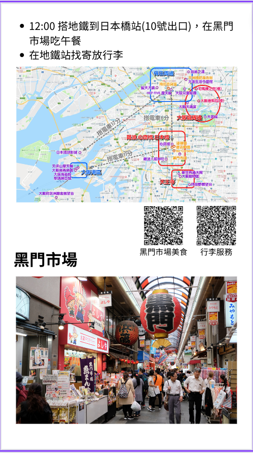
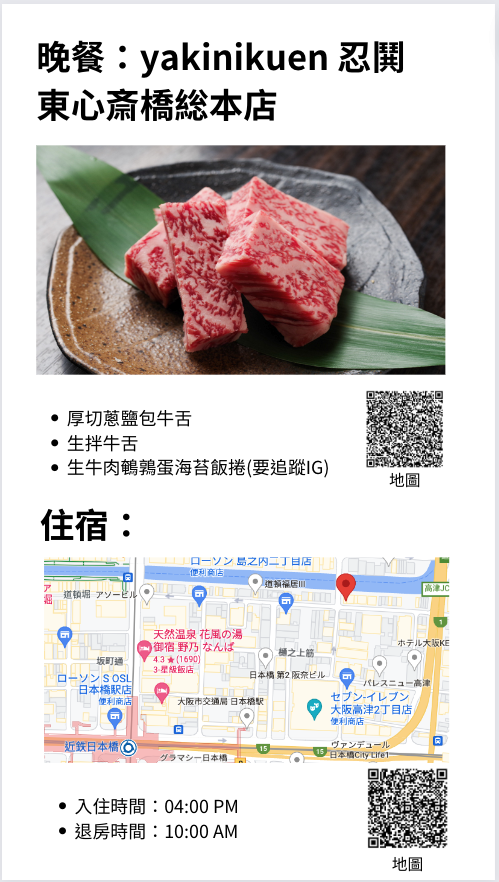
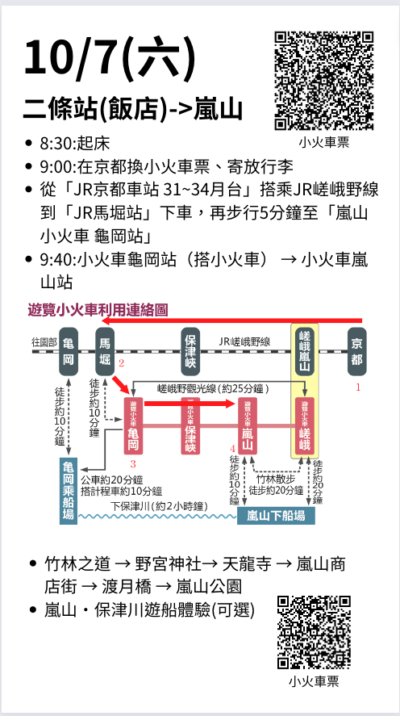

#  利用Canva製作旅遊手冊

[模板連結](https://www.canva.com/design/DAFv_FP7dLw/Jp2IOUre5AJx4xVdgx3iJw/view?utm_content=DAFv_FP7dLw&utm_campaign=designshare&utm_medium=link&utm_source=publishsharelink&mode=preview)

## 結果圖(更多請至模板連結看)

  

## 開頭

- 第一頁顯示每一天的重要斷點位置

## 內容

- 票卷QRCode可以貼好，方便換車票

- 相關景點的Blog利用[QRcode產生器](https://www.quickmark.com.tw/cht/qrcode-datamatrix-generator/default.asp?qrLink)產生QRcode

- 若有預約餐廳或者住宿，事先準備好導航QRcode，不用現場查詢，若旅伴失散也能各自找到地點

- 每個景點的描述、去的方法都可以詳細紀錄

