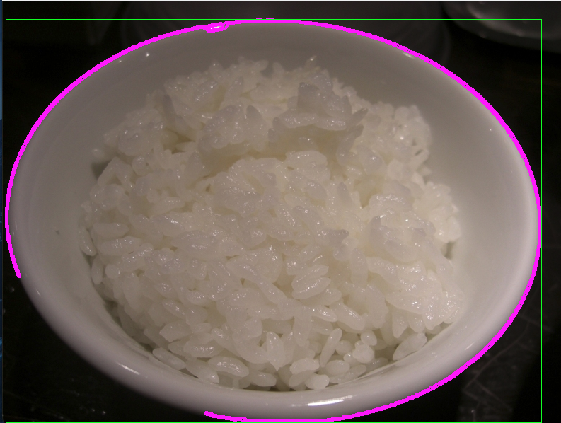
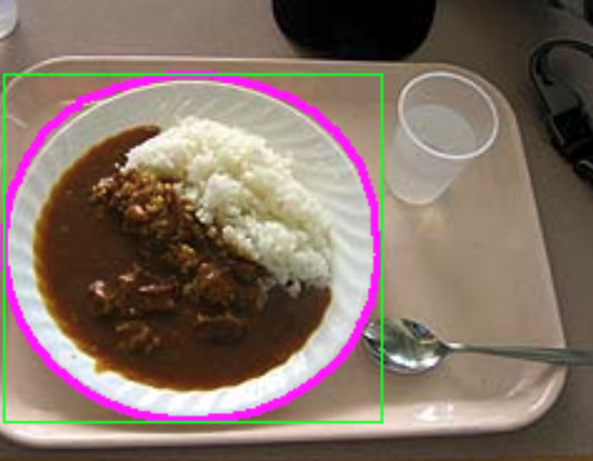
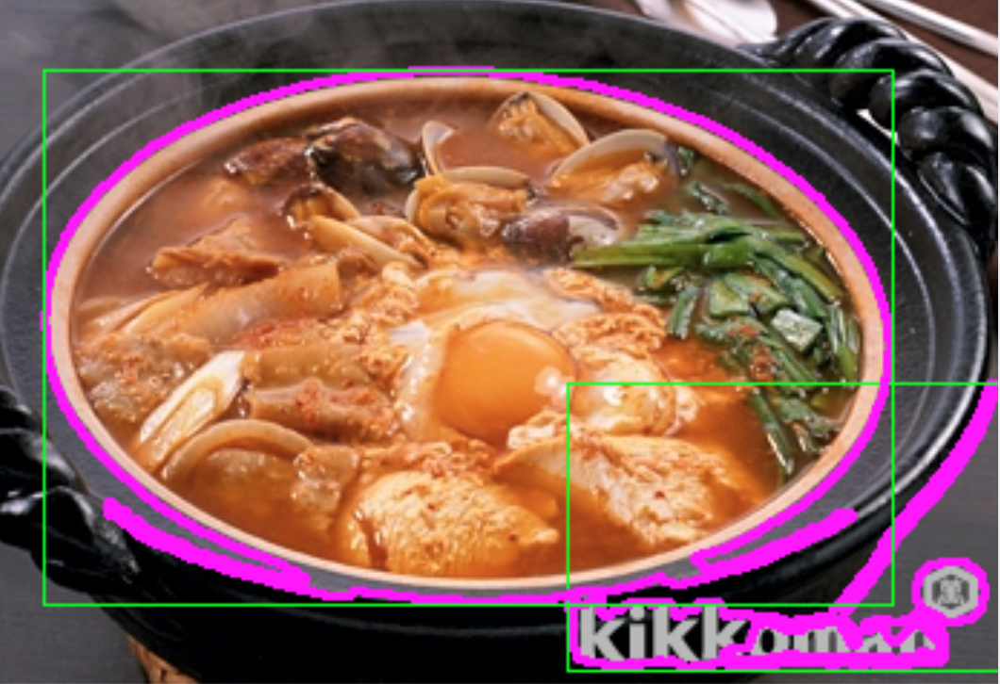
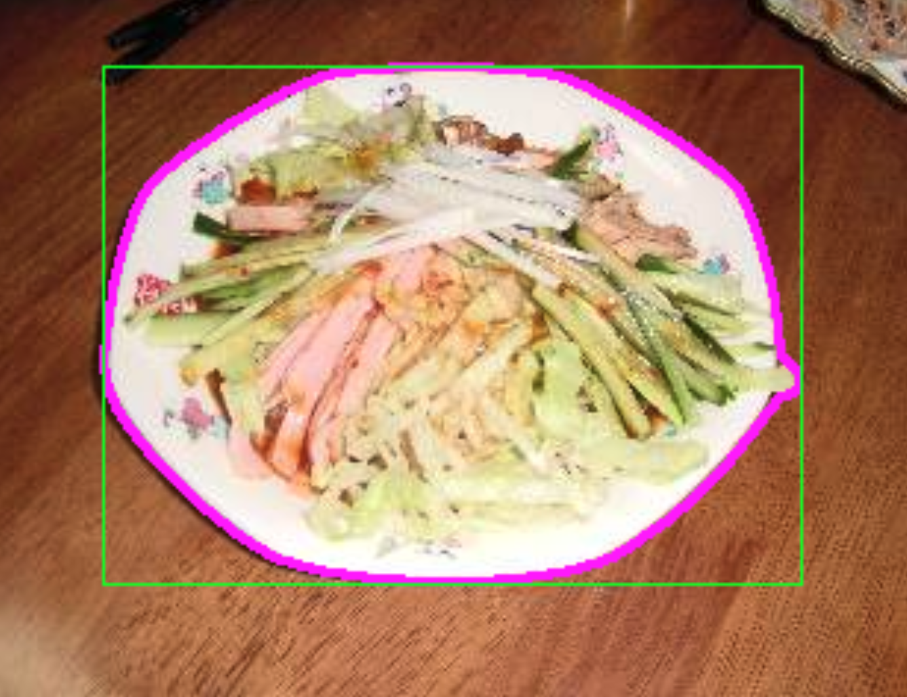
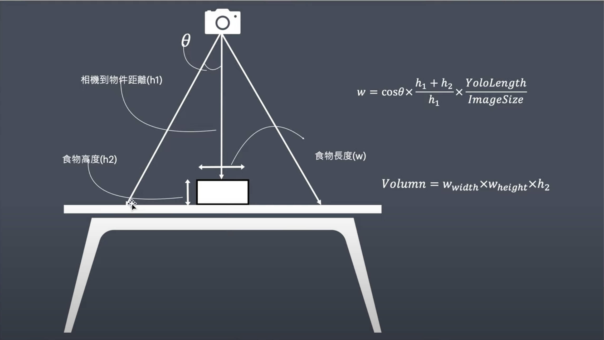

#  利用OpenCV計算食物份量(簡單版)

## 結果圖

   

## 流程

### 讀圖

```C

    string path = "Resources/12779.jpg";
    Mat img = imread(path);
-
```

### 將圖片模糊化(GaussianBlur)

```C

    // Preprocessing
    cvtColor(img, imgGray,COLOR_BGR2GRAY);
    GaussianBlur(img, imgBlur, Size(11,11), 3,0);
-
```

### 利用Canny演算法找邊緣

```C

    Canny(imgBlur, imgCanny, 50, 100);
-
```

### 填補空洞(Dilate)

```C
    
    Mat kernel = getStructuringElement(MORPH_RECT, Size(3,3));
    dilate(imgCanny, imgDil, kernel);
-
```


### 找邊緣點(findContours)->計算面積

```C

    //得到輪廓
    void getContours(Mat imgDil , Mat img){
        
        vector<vector<Point>> contours;
        vector<Vec4i> hierarchy;
        //找輪廓點
        findContours(imgDil,contours,hierarchy,RETR_EXTERNAL,CHAIN_APPROX_SIMPLE);
        string objectType;
        
        for (int i = 0; i<contours.size();i++){
            int area = contourArea(contours[i]);
            vector<vector<Point>> conPoly(contours.size());
            vector<Rect> boundRect(contours.size());
            if(area>1000){
    //          arcLength 函數通常用於計算輪廓的周長或曲線的長度。第二個參數 true 表示該輪廓是封閉的
                float peri = arcLength(contours[i], true);
    //          這一行code使用多邊形逼近方法對輪廓進行逼近;0.0001*peri：逼近的精度參數，它是相對於輪廓周長的百分比。輪廓周長的2%用於確定逼近的精度。這個值越小，逼近的多邊形就越接近原始輪廓。
                approxPolyDP(contours[i], conPoly[i], 0.0001*peri, true);
                drawContours(img, conPoly, i, Scalar(255,0,255),2);
    //          畫正方形方匡
                boundRect[i] = boundingRect(conPoly[i]);
                rectangle(img, boundRect[i].tl(), boundRect[i].br(),Scalar(0,255,0),1);
            }
        }
    }
-

```


### Total Code

```C

    Mat imgGray,imgBlur,imgCanny,imgDil,imgErode;
    //得到輪廓
    void getContours(Mat imgDil , Mat img){
        
        vector<vector<Point>> contours;
        vector<Vec4i> hierarchy;
        //找輪廓點
        findContours(imgDil,contours,hierarchy,RETR_EXTERNAL,CHAIN_APPROX_SIMPLE);
        string objectType;
        
        for (int i = 0; i<contours.size();i++){
            int area = contourArea(contours[i]);
            vector<vector<Point>> conPoly(contours.size());
            vector<Rect> boundRect(contours.size());
            if(area>1000){
    //          arcLength 函數通常用於計算輪廓的周長或曲線的長度。第二個參數 true 表示該輪廓是封閉的
                float peri = arcLength(contours[i], true);
    //          這一行code使用多邊形逼近方法對輪廓進行逼近;0.0001*peri：逼近的精度參數，它是相對於輪廓周長的百分比。輪廓周長的2%用於確定逼近的精度。這個值越小，逼近的多邊形就越接近原始輪廓。
                approxPolyDP(contours[i], conPoly[i], 0.0001*peri, true);
                drawContours(img, conPoly, i, Scalar(255,0,255),2);
    //          畫正方形方匡
                boundRect[i] = boundingRect(conPoly[i]);
                rectangle(img, boundRect[i].tl(), boundRect[i].br(),Scalar(0,255,0),1);
            }
        }
    }
    int main() {

        string path = "Resources/12779.jpg";
        Mat img = imread(path);
        
        // Preprocessing
        cvtColor(img, imgGray,COLOR_BGR2GRAY);
        GaussianBlur(img, imgBlur, Size(11,11), 3,0);
        Canny(imgBlur, imgCanny, 50, 100);
        Mat kernel = getStructuringElement(MORPH_RECT, Size(3,3));
        dilate(imgCanny, imgDil, kernel);
        getContours(imgDil,img);
        
        
        imshow("Image", img);
        waitKey(0);
        return 0;
    }
-

```
### 取得份量
- 得到面積後，使用swift ARKit技術可以得到相機到桌面距離(到平面距離)，依照公式求得物件體積。




## 影片解說 
- 詳細說明可以看以下影片，但其中物件偵測是使用Yolo模型判定。

