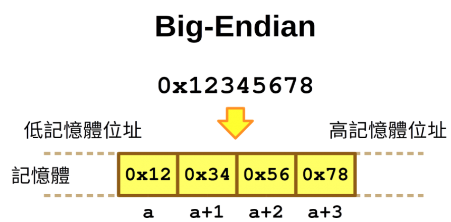
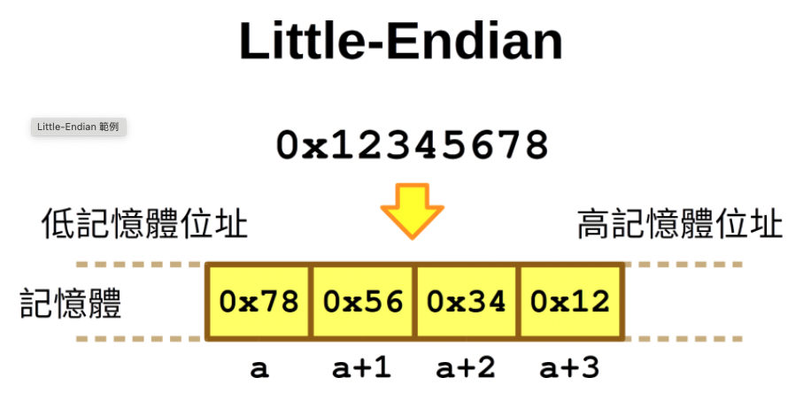

## Bitwise Operation

- Bitwise Left Shift(<<)
- Bitwise Right Shift(>>)
```
0001 << 1 = 0010
1000 >> 1 = 0100
-
```
- AND(&)
```
0 & 0 = 0
0 & 1 = 0
1 & 0 = 0
1 & 1 = 1
-
```
- or(|)
```
0 | 0 = 0
0 | 1 = 1
1 | 0 = 1
1 | 1 = 1
-
```
- xor(^)
```
0 ^ 0 = 0
0 ^ 1 = 1
1 ^ 0 = 1
1 ^ 1 = 0
-
```
- not(~)
```
~ 0 = 1
~ 1 = 0
-
```


## Link List & Array
- array: 會分配『連續』的記憶體空間給予陣列存放資料。
```C
    int x[5] = {1,2,3,4,5};
-
```
- stack: 後進先出
- queue: 先進先出

### Link List & Array 差別

功能| Link List   | Array     |
--------| --------  | -------- |
記憶體   | 不需要連續的空間 | 需要連續的空間 |
節點型態 | 各node形態不相同 | 各node形態相同 |
操作複雜度 | 插入、刪除都為O(n) | 插入刪除都為O(1)| |
空間配置 | 不需預留空間 | 須事先宣告連續空間 |
資料分割、連結 | 容易 | 不容易 |
存取方式 | 只能循序存取 | 可支援隨機與循序存取 |
存取速度 | 速度慢 | 速度快 |
可靠性 | 差 | 佳 |
額外指標空間 | 需要額外的指標空間 | 不需要 |


## Pointer

- 指標：某變數的位置。
- 指標變數：用來存放指標的變數。
- * 代表取值
- & 代表取記憶體位置 
### 題目
#### Q1: 
給一個int a[20]已排序的陣列，請寫一個function(a, size)能印出0~500的數字，且不包含a陣列內的元素，請用最少的時間和空間複雜度完成。

Ans:
```c
    void function(int* a, int size){
        int* ptr = a;
        for (int i = 0; i <= 500; i++) 
        {
            if (*ptr == i) 
                ptr++;
            else
                printf("%d", i); 
        }
    }
-
```
#### Q2: 
給一個int a[20]已排序的陣列，請寫一個function(a, size, b)能依照參數b(b = 0~4)別印出該區間的數字，且不包含a陣列內的元素，例如：

```c

    b = 0, 印出0~99
    b = 1, 印出100~199
    ...
-
```
Ans:
```c

    void function(int *a, int size, int b){
        int *ptr = a;
        int i;

        while (*ptr < b * 100) {
            ptr++;
        }

        for (i = b*100; i<(b+1)*100; i++) {
            if (*ptr == i)
                ptr++;
            else
                printf("%d\n", i);
        }
    }
-
```

#### Q3: 
情境題，給予一個 structure
```c
    struct ListStruct{
        unsigned int DataH;
        unsigned int DataL;
        unsigned int NextPtr;
    };
    struct ListStruct ListArray[1000];
    #define NULL 0xFFFF
    unsigned int ListHead = 0;
-
```
其中有兩個條件

-   條件一: ListArray[Entry1].NextPtr = ListArray[Entry2]
-   條件二: ListArray[Entry2].DataH << 16 + ListArray[Entry2].DataL > ListArray[Entry1].DataH << 16 + ListArray[Entry1].DataL

代表
- 第一個 index 中的 NextPtr 會指到另一個 index 中的起始位址 
- 另一個 index 中的起始位址的資料內容大小一定大於原起始資料的大小
- 請寫一個function(unsigned int DATA_A, unsigned int DATA_B)，
能在ListArray中找到符合ListArray[Entry].DataH == Data_A 且 ListArray[Entry].DataL == Data_B
並印出其結果。如果沒有找到的話，印出”no found.”。

```C
void Q3(unsigned int DATA_A, unsigned int DATA_B)
{
    int found_entry = ListHead;
    int pre_entry = NULL;
    int next_entry = NULL;

    while (ListArray[found_entry].NextPtr != NULL) {
        if (ListArray[found_entry].DataH == DATA_A && ListArray[found_entry].DataL == DATA_B) {
	    if (pre_entry == NULL)
	        printf("pre_entry = NULL, found_entry = ListHead\n");
            else
	        printf("pre_entry = %d, found_entry = %d", pre_entry, found_entry);
	    printf("found it\n");

	    next_entry = ListArray[found_entry].NextPtr;
	    if (ListArray[next_entry].DataH << 16 + ListArray[next_entry].DataL >
	        DATA_A << 16 + DATA_B)
		break;
	}

	pre_entry = found_entry;
	found_entry = ListArray[found_entry].NextPtr;
    }

}
-
```

## Sort

- Quick sort

```C
    #define SWAP(x,y) {int t; t = x; x = y; y = t;} 

    void quickSort(int number[], int left, int right) { 
        if(left < right) { 
            int s = number[(left+right)/2]; 
            int i = left - 1; 
            int j = right + 1; 

            while(1) { 
                while(number[++i] < s) ;  // 向右找
                while(number[--j] > s) ;  // 向左找 
                if(i >= j) 
                    break; 
                SWAP(number[i], number[j]); 
            } 

            quickSort(number, left, i-1);   // 對左邊進行遞迴 
            quickSort(number, j+1, right);  // 對右邊進行遞迴 
        } 
    } 
-
```
## Search

- Binary serach

```C
    int binsearch(int* arr, int k, int n) {
    int left = 0, right = n;
    while (left <= right) {
        int mid = (left+right)/2;
        if (arr[mid] > k) {       // 往左半部找
        right = mid - 1;
        }
        else if (arr[mid] < k) {  // 往右半部找
        left = mid + 1;
        }
        else
        return mid;
    }
    return -1; // not found
    }
-
```

## Big / Little -Endian

- 在現今主流的 CPU 中，最常見的位元組順序有兩種，分別是 Big-Endian 與 Little-Endian，Big-Endian 是指資料放進記憶體中的時候，最高位的位元組會放在最低的記憶體位址上，而 Little-Endian 則是剛好相反，它會把最高位的位元組放在最高的記憶體位址上。




## 不同 type pointer++時，memery address的差別

- 當你對一個int指針執行pointer++操作時，它會遞增內存地址，遞增的內存地址通常是4或8字節。
- 當你對一個char指針執行pointer++操作時，它會遞增內存地址，遞增的內存地址通常是1字節。
## Copy by value / Call by reference 的意思

- Copy by value:當你將參數傳遞給函數時，函數使用參數的副本來執行操作。這意味著在函數內部對參數的任何更改都不會影響原始參數的值。
- Call by reference:當你將參數按引用傳遞給函數時，函數可以直接訪問和修改原始參數的值，因為它具有對原始參數內存位置的引用。

## Struct / Union / Enum

結構體（struct）用於組織具有不同數據類型的成員變數，每個成員變數占據獨立的內存空間。
聯合體（union）用於組織具有相同起始位置的成員變數，它們共享內存空間。
列舉（enum）用於定義命名常數集合，通常實現為整數值。


- 結構體（struct）：
    - 結構體用於定義一種自定義的數據類型，它可以包含多個不同類型的成員變數（字段），每個成員變數占據自己的內存空間。
    - 結構體的內存布局是成員按照定義的順序依次排列，每個成員變數在內存中占據連續的空間。
    - 結構體的內存大小等於所有成員變數的內存大小之和，沒有內存重疊。

- 聯合體（union）：
    - 聯合體也是用於組織數據的構造，但它與結構體不同，它的成員共享相同的內存位置。
    - 聯合體的內存布局是所有成員共享相同的內存空間，占據的空間等於最大成員的大小。
    - 僅能同時使用一個成員變數，改變一個成員的值會影響其他成員。

- 列舉（enum）：
    - 列舉用於定義一組命名常數，它們在內存中通常被實現為整數值。
    - 列舉的內存布局通常是整數，它們的值按照聲明的順序遞增，但它們只占據一個整數的內存空間。


## OS
### 解釋multi-thread、multi-process
它們允許程序同時執行多個任務，提高了程序的性能和響應能力。

- 多線程通過在單個進程內並發執行多個線程來提高程序性能，線程之間共享相同的內存和資源。
- 多進程通過在操作系統中並發執行多個獨立的進程來提高程序性能，每個進程有自己的獨立內存和資源。
- 多線程適用於需要共享數據或共享內存的情況，而多進程適用於需要隔離和保護數據的情況。選擇哪種方式取決於應用程序的需求和性能要求。


## 題目

### 最大公因數

```C

    int gcd(int x, int y) {
        // x > y
        if (y == 0)  /* 餘 0，除數 x 即為最大公因數 */
            return x;
        else
            return gcd(y, x % y);  /* 前一步驟的除數為被除數，餘數為除數 */
    }
-
```
### 字串反轉
```C
    void swap(char* a, char* b) {
    char t = *a;
    *a = *b;
    *b = t;
}

    void reverseString(char* s, int sSize){
        if (s == NULL) return NULL;
        int j = sSize - 1;
        for (int i = 0; i < sSize/2; i++) {
            swap( &s[i], &s[j] );
            j--;
        }
    }
-
```


### 給一個unsigned short, 問換算成16進制後四個值是否相同? 若是回傳1,否則回傳0

```C
    int isHexEqaul(unsigned short input) {     // input = 0xAAAA;
    unsigned short input;
    unsigned short hex[4]; // 0xFFFF ==> 0000 0000 0000 0000
    int is_eqaul;

    hex[0] = (input & 0xF000) >> 12;
    hex[1] = (input & 0x0F00) >> 8;
    hex[2] = (input & 0x00F0) >> 4;
    hex[3] = input & 0x000F;

    is_eqaul = ((hex[0] == hex[1]) && (hex[1] == hex[2]) && (hex[2] == hex[3]));
    return is_eqaul;
}
-
```
### 求一個數的最高位1在第幾位
```C
    int main(){
        unsigned int a = 0x65; // 0110 0101
        unsigned int test_bit = 128; // 1000 0000
        int count = 7;  // sizeof(unsigned int)*8   == 該data type的bit數
        while (((a & test_bit) >> count) != 1) {
            count--;
            test_bit >>= 1;
        }
        printf("hightest bit is %d th bit\n", count);
        
        return 0;
    }
-
```


