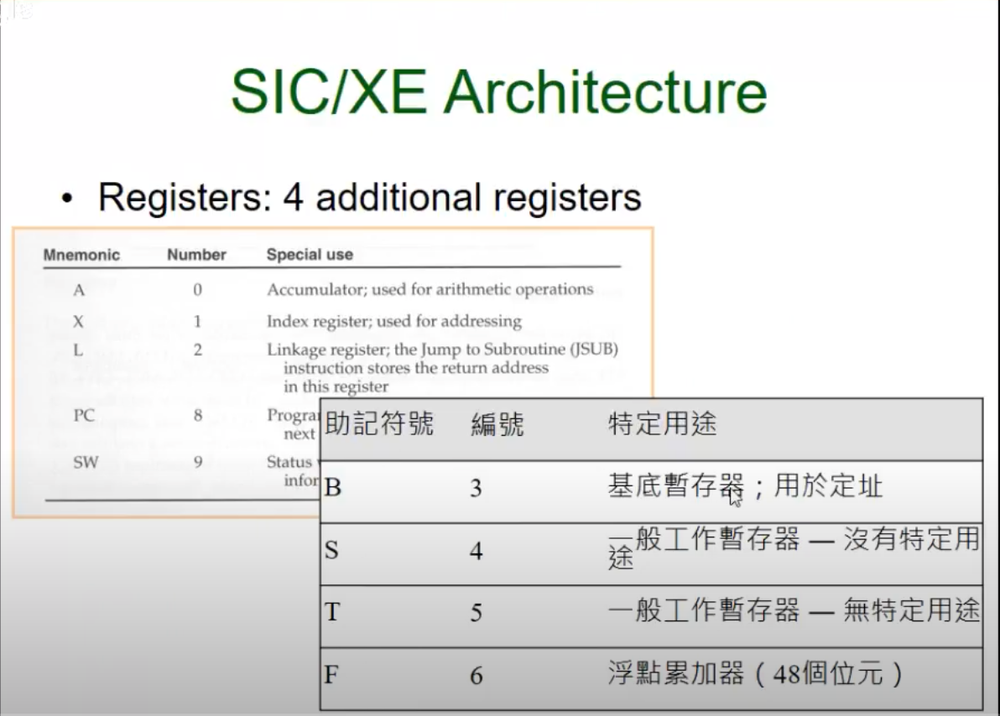
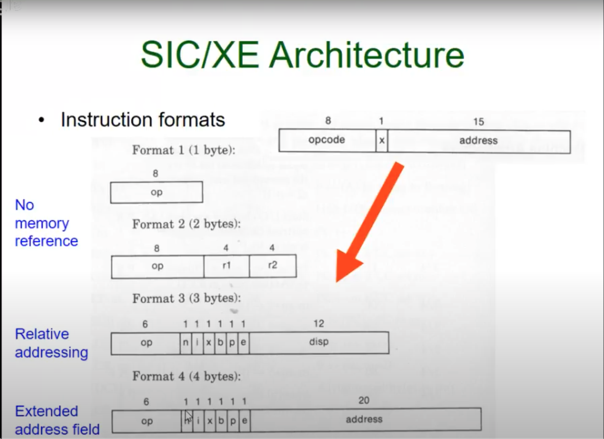
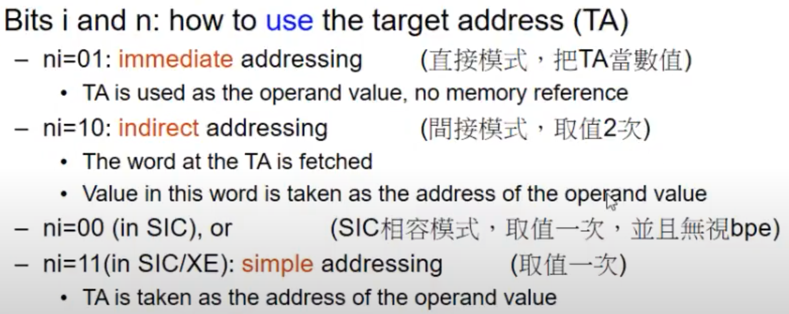
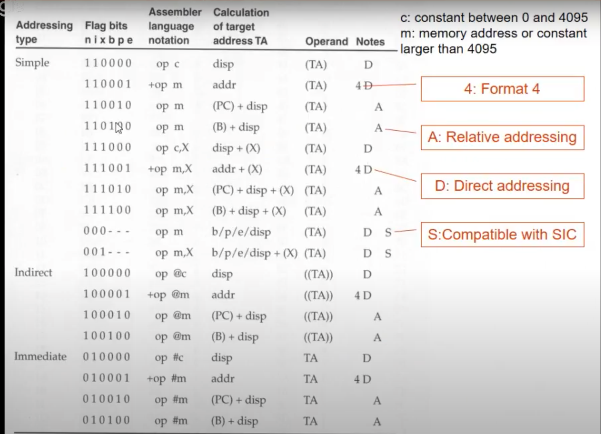
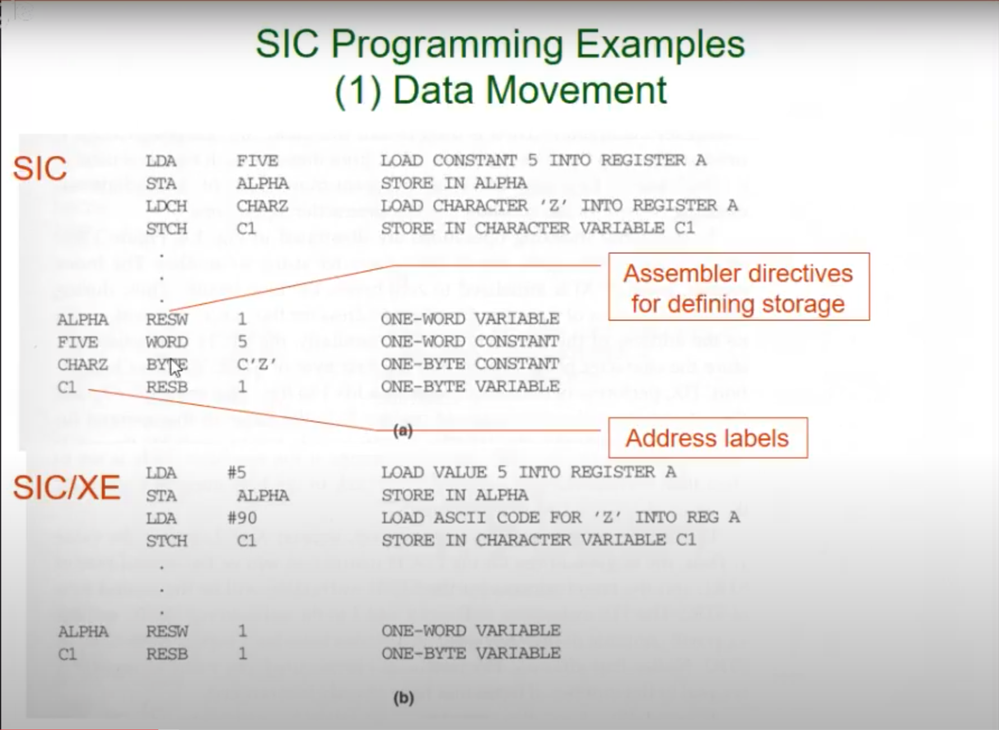
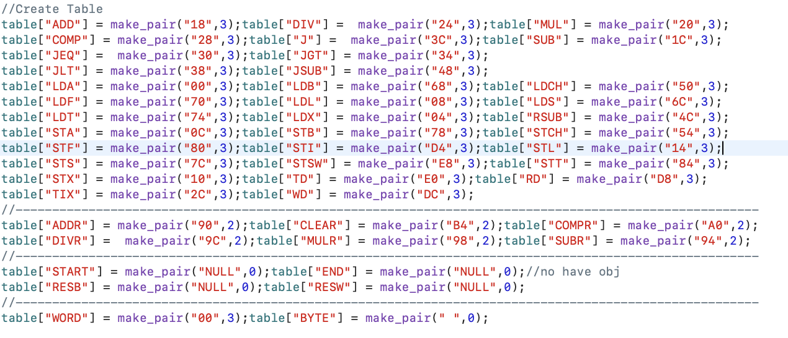

## AssembleSIC和AssembleSIC/XE版本差別

- 多四個暫存器，圖1
- 從一個指令格式變成四個指令格式，圖2
- 取值模式ni，圖3
- ni 10跟01不存在x

  

- pc、b、e任兩個不會同時為1，在ni不是11時，反之是11時，可與x同時存在。圖4
- SIC版本所有數字都要宣告，反之圖5



- 詳細請參閱[教學](https://www.youtube.com/watch?v=HGK1n__BmoY)

## AssembleSIC
### 主程式
- [Github](https://github.com/skysora/AssembleSIC)
#### Step1:製作編碼對應表


#### Step2:將對應位置Label、operationCode、operand存入變數中
```C
while(getline(input,str)){
    flag=0;
    if(str==" "||str[0]=='.'){
        continue;
    }
    flag=0;
    int a  = str.length();
    if(searchMarker(str,0)<=str.length()){
        lable[i] = str.substr(0,7);//(position,lenght)
    }if((flag!=1) && (searchMarker(str,8)<=str.length())){
        operationCode[i] = str.substr(8,8);
    }if((flag!=1) && (searchMarker(str,16)<=str.length())){
        operand[i] = str.substr(16,8);
    }else{
        operand[i] = "";
    }
    deleteMark(lable[i]);
    deleteMark(operationCode[i]);
    deleteMark(operand[i]);
    
    iter = table.find(operationCode[i].c_str());
    if(iter==table.end()){
        errorMessage[i] = operationCode[i];
    }
    printf("%-5d%-8s%-8s%-8s\n",i,lable[i].c_str(),operationCode[i].c_str(),operand[i].c_str());
    i++;
}
-
```
#### Step3:計算location和location內的內容，location內的內容還未完整

- 因為有些變數在後面宣告所以要先跑一遍所有指令

```C
for(j = start;j<=length;j++) {
    
    if(!errorMessage.empty()){
        printf("Error!!\n");
        for(errorMessageIter = errorMessage.begin();errorMessageIter!=errorMessage.end();errorMessageIter++){
            printf("%-2d %-8s\n",errorMessageIter->first,errorMessageIter->second.c_str());
        }
        return 0;
    }else{
        obj[j] = searchMap(operationCode[j]);
//            不會生成機器碼的走這裡
        if(!table[operationCode[j].c_str()].first.compare("NULL")){//actual location
            if(!operationCode[j].compare("RESW")){
                //RESW表示我們要定義一個字（word）型數據，並分配儲存空間。
                addition =hexadecimalConvertDecimal(location[j]) + atoi(operand[j].c_str())*3;
                location[j+1] = decimalConvertHexadecimal(addition);
            //RESB 表示我們要定義一個位元組（byte）型數據，並分配儲存空間。
            }else if(!operationCode[j].compare("RESB")){
                addition =hexadecimalConvertDecimal(location[j]) + atoi(operand[j].c_str());
                location[j+1] = decimalConvertHexadecimal(addition);
            }else{
                location[j+1] = location[j];
            }
        }else{
//                operationCode[j]等於"BYTE"，則compare函數將傳回值0
            if(!operationCode[j].compare("BYTE")){
                //字元型數據
                if(operand[j][0]=='C'){
                    //減三個字元，像是C''
                    addition = hexadecimalConvertDecimal(location[j]) + (operand[j].length()-3);
                    location[j+1] = decimalConvertHexadecimal(addition);
                }else{
                    //表示16進制
                    addition = hexadecimalConvertDecimal(location[j]) + (operand[j].length()-3)/2;
                    location[j+1] = decimalConvertHexadecimal(addition);
                }
            }else{
                addition = hexadecimalConvertDecimal(location[j]) + table[operationCode[j].c_str()].second;
                location[j+1] = decimalConvertHexadecimal(addition);
            }
        }
        //沒有Label的加入table
        if(!lable[j].empty()){
            symbolTable[lable[j].c_str()] = make_pair(j,location[j].c_str());
        }
        printf("%-2d%-8s%-10s%-8s%-8s\n",j,operationCode[j].c_str(),operand[j].c_str(),obj[j].c_str(),location[j].c_str());
    }
}
-
```
#### Step4:補充完location內的內容，產生S、Ｔ、E卡內容

- S卡（Start Card）：

    * 用途：S卡用於指定程式的起始位址。
    * 格式：S卡的格式通常為 S,起始位址。
    * 範例：S,0040 表示程式從位址 0040 開始執行。
- T卡（Text Card）：

    * 用途：T卡用於包含程式的目標代碼指令或資料。
    * 格式：T卡的格式通常包括起始位址、長度和目標碼欄位。
    * 範例：T,0040,0014,2F4D2F4F2F54... 表示從位址 0040 開始的程式碼，長度為 0014 位元組，包含一系列目標程式碼。

- E卡（End Card）：
    * 用途：E卡用於指定程式的終止位址，即程式的結束。
    * 格式：E卡的格式通常為 E,終止位址。
    * 範例：E,007C 表示程式在位址 007C 結束執行。

```C
for(j = start;j<=length;j++) {
    if(!errorMessage.empty()){
        return 0;
    }else{
        // 用於產生程式的起始卡（Start Card）
        if(!operationCode[j].compare("START")){
            Scard.append("S,");
            Scard.append(operationCode[j].c_str());
            Scard.append(",");
            Scard.append(lable[j].c_str());
            Scard.append(",");
            int a = hexadecimalConvertDecimal(location[length].c_str());
            int b = hexadecimalConvertDecimal(location[j].c_str());
            Scard.append(decimalConvertHexadecimal(a-b));
//                cout<<Scard<<endl;
        }
        // 用於產生程式的結束卡（End Card）
        if(!operationCode[j].compare("END")){
            Ecard.append("E,");
            Ecard = Ecard + symbolTable[operand[j].c_str()].second;
//                cout<<Ecard<<endl;
        }
        
        // 不在table的operationCode沒有機器碼
        if(!table[operationCode[j].c_str()].first.compare("NULL")){
            obj[j] = "";
            
        //若 symbolTable.find(operand[j].c_str()) 找到了匹配的键，則回傳true
        }else if(symbolTable.find(operand[j].c_str()) != symbolTable.end()){
            obj[j].append(symbolTable[operand[j].c_str()].second,0,4);
//                printf("%-8s %-8s\n",lable[j].c_str(),obj[j].c_str());
        //算位元編碼
        }else if(!operationCode[j].compare("BYTE")){
            obj[j] = "";
            if(operand[j][0]=='C'){
                for(int i=2;i<operand[j].length()-1;i++){
                    int oper = operand[j][i];
                    str = decimalConvertHexadecimal(oper);
                    while(str[0]=='0'){
                        str.erase(0,1);
                    }
                    obj[j] = obj[j]+str;
                }
            }else{
                obj[j] = obj[j].append(operand[j],2,operand[j].length()-3);
            }
        //RSUB：這是一個彙編指令，表示“Return from SUBroutine”，意思是從子程式返回。
        }else if(!operand[j].compare("RSUB")){
            //如果是其中之一，表示找到了跳躍或比較的指令。
            for(i=j;;i--){
                if(operationCode[i].compare("JSUB") == 0 || operationCode[i].compare("J")==0 || operationCode[i].compare("COMP")==0){
                    break;
                }
            }
            obj[j].append(location[i].c_str(),0,4);
        }else if(operand[j].find(",X")!=-1){
            int xPosition = operand[j].find(",X");
            temp = operand[j].substr(0,xPosition);
            printf("%s\n",temp.c_str());
            obj[j].append(symbolTable[temp].second,0,4);
            //它的目的是將字串 obj[j] 中的某個字元位置的十六進位值加上 8。*這裡不太確定
            obj[j] = covertHexadecimal(obj[j],8,2);
        }else{
            obj[j].append(location[j].c_str(),0,4);
        }
//           ----------------------------------------
        objLength+=obj[j].length();
        //T卡是一種用於表示程式目標程式碼的文字格式，通常由位址、指令或資料以及其他相關資訊組成。
        if(obj[j].length() == 0){//creat Tcard
            if(objLength>0){
                Tcard[k] = creatTcard(objLength,j-1,obj,location,start++);
                start = j+1;
                k++;
                objLength=0;
            }else{
                start++;
                continue;
            }
        }else if(objLength>=30 || obj[j].length()!=6){
            Tcard[k] = creatTcard(objLength,j,obj,location,start);
//                printf("Tcard %d:%s\n",k,Tcard[k].c_str());
            start = j+1;
            k++;
            objLength=0;
        }
    }
//        printf("%-2d%-8s%-10s%-8s%-8s\n",j,operationCode[j].c_str(),operand[j].c_str(),obj[j].c_str(),location[j].c_str());
}
-
```

### 副程式
#### searchMarker

- 搜尋空白字元，並回傳該字元出現的第一個位置
- 以position作為切割點切割a並往前搜尋空白字元位置回傳
```C
    int searchMarker(string a,int position){
        if(a.find(' ',position)!=-1){
            return a.find(' ',position);
        }else{
            flag = 1;
            return a.length();
        }
    }
-
```

#### deleteMark

- 刪除多餘的字元
```C
    void deleteMark(string &str){
        str.erase(std::remove(str.begin(), str.end(), ' '), str.end());
        str.erase(std::remove(str.begin(), str.end(), '\r'), str.end());
    }


```
#### searchMap

- 搜隊table中對應的編碼
```C
    string searchMap(string a){
        for(iter=table.begin();iter!= table.end();iter++){
            //cout<<iter->first<<iter->second<<endl;
            if(strcompare(a,iter->first)==1){
                return iter->second.first;
            }
        }
        return "null";
    }
-
```
#### covertHexadecimal

- 將一個十六進位數字字串進行加法運算
```C
string covertHexadecimal(string a,int addition,int position){
    int number;
    //printf("a[position]:%d\n",a[position]);
    if(a[position]>64){
        number = a[position]-55;
    }else{
        number = a[position]-48;
    }
    number+=addition;
    //printf("number:%d\n",number);
    if(number<0){
        a = covertHexadecimal(a,-1,position-1);
        a = covertHexadecimal(a,addition+16,position);
    }else if(number<10 && number>=0){
        a[position] = number+48;
    }else if(number>9&&number<16){
        a[position] = number+55;
    }else{
        int carry = number/16;
        number = number%16;
        a = covertHexadecimal(a,carry,position-1);
        a[position] = number+48;
    }
    return a;
}
-
```


## AssembleXE
### 主程式

- [Github](https://github.com/skysora/AssembleXE)
#### Step1:製作編碼對應表


#### 掃第一遍計算location

```python
for line in file.readlines():
    data.append(Row("0","","","","",""))
    if(line[0]=="."):
        continue
    data[i].label = line[0:7].replace(" ","").replace("\n","")
    data[i].code = line[7:15].replace(" ","").replace("\n","")
    data[i].value = line[15:35].replace(" ","").replace("\n","")
    #------------------------------------------------------------------------------------------------------
    #如果遇到要換區塊換區塊
    flag,BLOCK = data[i].decideCode(BLOCK,data[i-1]) 
    #------------------------------------------------------------------------------------------------------
    #LITTAB是一個用於儲存文字文字表（Literal Table）的資料結構或字典。 文字文字表通常用於儲存程式中的文字常數，並為它們指派一個唯一的識別碼。
    #計算字元or數值的ASCII
    if(data[i].value!="" and str(data[i].value)[0] == '='):
        if (data[i].value[1]=='C'): 
            temp = binascii.b2a_hex(str(data[i].value[3:len(data[i].value)-1]).encode('utf-8'))
            a = len(data[i].value)-4 
        else:
            temp = str(data[i].value[3:len(data[i].value)-1])
            a = (len(data[i].value)-4)/2
            
        LITTAB[str(LITTAB_number)] = [str(data[i].value[1:]),temp,a,data[i].loc]
        # print(LITTAB)
        LITTAB_number = LITTAB_number + 1
    #------------------------------------------------------------------------------------------------------
    # 若不為虛擬指令執行這裡，現在位置+上指令容量
    if(data[i].code != "END" and data[i].code != "ORG" and data[i].code != "LTORG" and data[i].code != "BASE"):
        # "+" 開頭，表示這是擴充格式的指令。
        # flag為本行指令location
        if(data[i].code[0] == "+"):
            # data[i].code)[1::]為去除+好的code
            data[i+1].loc = '{0:x}'.format(int(str(flag),16) + int(1) + int(add(data[i].code[1::],data[i].value,codeDict[str(data[i].code)[1::]][1])))
        else:
            if(data[i].code == "USE"):
                data[i].loc = "NULL"
                data[i].block = "NULL"
#             print(str(flag) + "+" + str(add(data[i].code,data[i].value,codeDict[str(data[i].code)][1])))    
            data[i+1].loc = '{0:x}'.format(int(str(flag),16) + int(add(data[i].code,data[i].value,codeDict[str(data[i].code)][1])))
#     ------------------------------------------------------------------------------------------------------          
    # BASE 指令的作用是告訴組譯器或組譯器，在後續的指令中，使用 operand 指定的位址作為基底位址來計算相對位址。 這樣可以減少在程式中手動計算相對位址的複雜性。
    elif(data[i].code == "BASE"):
        BASETABLE[str(i)] = [BLOCK,data[i].loc,data[i].value]
        data[i+1].loc = data[i].loc
        data[i+1].block = data[i].block
    elif(data[i].code =="ORG"):
        # 那麼意味著 ORG 指令是無操作的，它只是用來標記當前位置。 在這種情況下，data[i+1] 的 loc 和 block 屬性被設定為先前儲存的 org 物件的 loc 和 block 屬性的值，以恢復先前的位置。
        if(data[i].value == "*"):
            data[i+1].loc = org.loc
            data[i+1].block = org.block
        # 則表示 ORG 指令要求程式跳到一個新的位址。 decideOperation 函數可能被用來計算新位址的值
        else:
            value,decideRelative = decideOperation(data[i].value)
            data[i+1].loc = '{0:x}'.format(int(value))
            data[i+1].block = BLOCK
            org.loc = data[i].loc
            org.block = data[i].block
        data[i].loc = "NULL"
        data[i].block = "NULL"
    #------------------------------------------------------------------------------------------------------ 
    elif(data[i].code == "LTORG" or data[i].code == "END"):
        if(data[i].code =="LTORG"):
            data[i+1].loc = data[i].loc
        # 程式結束後新增宣告
        for j,k in enumerate(LITTAB):
            i = i + 1
            data[i].label = "*"
            data[i].block = data[i-1].block
            data[i].code = "*"
            data[i].value = "=" + str(LITTAB[str(k)][0])
            data[i+1].loc = '{0:x}'.format(int(str(data[i].loc),16) + int(LITTAB[str(k)][2]))
            SYMBOLTABLE[data[i].value] = [i,data[i].block,data[i].loc]
#             print('%-2s %-4s %-8s %-8s %-8s %-15s %-8s' % (i,str(data[i].loc).zfill(4),data[i].block,data[i].label,data[i].code,data[i].value,data[i].obj))
        LITTAB = {}
    else:
        print("talk")
    #------------------------------------------------------------------------------------------------------
    #紀錄Label
    if(data[i].label != ""):
        if(data[i].code == "EQU" and data[i].value != "*"):
            value,decideRelative = decideOperation(data[i].value)
            if(decideRelative%2==0):
                data[i].block = "NULL"
            EQUTABLE[data[i].label] = [i,BLOCK,value]
            SYMBOLTABLE[data[i].label] = [i,BLOCK,value]
#             print(EQUTABLE)
        else:
            SYMBOLTABLE[data[i].label] = [i,BLOCK,data[i].loc]
    #------------------------------------------------------------------------------------------------------
#     print('%-2s %-4s %-8s %-8s %-8s %-15s %-8s' % (i,str(data[i].loc).zfill(4),data[i].block,data[i].label,data[i].code,data[i].value,data[i].obj))
    i = i + 1
length = i
ProgramBlockTable = {"default":[0,"0",ProgramEnd[0]],
                    "CDATA":[1,ProgramEnd[0],ProgramEnd[1]],
                    "CBLKS":[2,'{0:x}'.format((int(str(ProgramEnd[0]),16) + int(str(ProgramEnd[1]),16))),ProgramEnd[2]]}
#--------------------------------------------------------------------------------------------------------------------------

for i,k in enumerate(SYMBOLTABLE):
    if(k in EQUTABLE):
        SYMBOLTABLE[k][1] = 0
# --------------------------------------------------------------------------------------------------------------

```

#### 掃第二遍計算obj，並建立卡片

- H卡（Header Card）：H卡是目標程式檔案的頭卡，用於提供有關程式的基本信息，如程式名稱、程式起始位址、程式長度等。 在給定的程式碼中，H = "" 似乎表示沒有H卡資訊。

- T卡（Text Card）：T卡包含了程式的機器指令以及它們在記憶體中的位址資訊。 T卡由一個起始位址和一系列的機器指令組成，每個指令通常以一個十六進位數表示。 在給定的程式碼中，T = [] 可能表示目標程式不包含T卡資訊或T卡為空。

- M卡（Modification Card）：M卡用於指示需要在程式載入時對記憶體中的資料進行修改的資訊。 這可以用來支援程式的重定位。 在給定的程式碼中，M = [] 可能表示沒有M卡資訊或M卡為空。

- E卡（End Card）：E卡用來標示目標程式的結束，包含程式的入口點位址。 在給定的代碼中，E = [] 可能表示沒有E卡資訊或E卡為空。

```python
H = ""
T = []
M = []
E = []
number = 0
count = 0
TcardNumber = 0
for i,k in enumerate(data):
    Extend  = 0
    #------------------------------------------------------------------------------------------------------
    if(i == length):
        break
    if(k.code == "START"):
        H = "H,"+ str(k.label) +","+ str(k.loc).zfill(4) + ","+str('{0:x}'.format(int(str(ProgramEnd[0]),16) + int(str(ProgramEnd[1]),16) + int(str(ProgramEnd[1]),16)))
        k.obj = "NULL"
#         print('%-2s %-4s %-8s %-8s %-8s %-8s %-15s %-8s' % (i,str(k.loc).zfill(4),k.block,correctPosition(k.block,k.loc).zfill(4),k.label,k.code,k.value,k.obj))
        continue
    elif(k.code == "END"):
        E = "E," + str(k.value)
    elif(k.code == "USE" or k.code == "RESW" or k.code == "EQU" or k.code == "LTORG" or k.code == "ORG" or k.code == "BASE"):
        k.obj = "NULL"
    elif(k.code == "COMPR"):
        behind = str(codeDict[str(k.code)][0])
        k.obj = behind + str(LEETTERTABLE[str(k.value[0])]) + str(LEETTERTABLE[str(k.value[len(k.value)-1])])
    elif(k.code == "CLEAR"):
        behind = str(codeDict[str(k.code)][0])
        k.obj = behind + str(LEETTERTABLE[str(k.value)]) + "0"
    elif(k.code == "RSUB"):
        k.obj = str(codeDict[str(k.code)][0]) + "0000"
    elif(k.value == ""):
        k.obj = "000000"
    elif(k.code == "RESB"):
        k.obj = "NULL"
    elif(k.code == "BYTE"):
        if(k.value[0] == 'C'):
            k.obj = binascii.b2a_hex(str(data[i].value[3:len(data[i].value)-1]).encode('utf-8'))
        else:
            k.obj = k.value[2:len(k.value)-1]
    elif(k.value[0] == "#" or k.value[0] == "@" or k.code[0] == "+" or k.value in SYMBOLTABLE or k.value[0:len(k.value)-2] in SYMBOLTABLE):
        #如果value是在SYMBOLTABLE裡
        if(k.value in SYMBOLTABLE or k.value[1::] in SYMBOLTABLE or k.value[0:len(k.value)-2] in SYMBOLTABLE):
    #------------------------------------------------------------------------------------------------------
            if(k.value[1::] in SYMBOLTABLE):
                NOW = correctPosition(SYMBOLTABLE[k.value[1::]][1],SYMBOLTABLE[k.value[1::]][2])
                Mcard = "M," + str(k.loc).zfill(6) +  ",+" + str(k.value[1::])
            elif(k.value[0:len(k.value)-2] in SYMBOLTABLE):
                NOW = correctPosition(SYMBOLTABLE[k.value[0:len(k.value)-2]][1],SYMBOLTABLE[k.value[0:len(k.value)-2]][2])
                Mcard = "M," + str(k.loc).zfill(6) + ",+" + str(k.value[0:len(k.value)-2])
            elif(k.value in SYMBOLTABLE):
                NOW = correctPosition(SYMBOLTABLE[k.value][1],SYMBOLTABLE[k.value][2])
                if(k.code != "*"):
                    Mcard = "M," + str(k.loc).zfill(6) + ",+" + str(k.value)
            M.append(Mcard)
            #======================================================================================================
            if(k.code[0] == "+"):#有加號
                behind = str(codeDict[str(k.code[1::])][0]) + "00"
            else:
                behind = str(codeDict[str(k.code)][0])
            #======================================================================================================
            if(data[i].code[0] != "+"):
                PC = '{0:x}'.format((int(str(correctPosition(data[i].block,data[i].loc)),16)) + int(add(data[i].code,data[i].value,codeDict[str(data[i].code)][1])))
            else:#沒有+號後面是label
                PC = '{0:x}'.format((int(str(correctPosition(data[i].block,data[i].loc)),16)) + int(1) + int(add(data[i].code[1::],data[i].value,codeDict[str(data[i].code[1::])][1])))
#             print("behind:" + str(behind))
#             print("Now:" + str(behind))
    #------------------------------------------------------------------------------------------------------   
            if(k.code[0] == "+" and k.value[1::] in SYMBOLTABLE):#+號後面是字符直接放
                k.obj = behind +str(correctPosition(SYMBOLTABLE[k.value[1::]][1],SYMBOLTABLE[k.value[1::]][2]))
            elif(k.code[0] == "+" and k.value in SYMBOLTABLE):#+號後面是字符直接放
                k.obj = behind +str(correctPosition(SYMBOLTABLE[k.value][1],SYMBOLTABLE[k.value][2]))
            elif( (int(str(NOW),16)-int(str(PC),16) > 1000 or int(str(NOW),16)-int(str(PC),16) < -1000) and Extend == 0):
                small = i
                flag = 0
                for n,m in enumerate(BASETABLE):
#                     print(closedBasePosition)
                    if(flag==0):
                        closedBasePosition = m
                        flag = 1
                    if(int(closedBasePosition) - i < small):
                        closedBasePosition = m
                if(BASETABLE[str(closedBasePosition)][2] in SYMBOLTABLE):
                    BASE = correctPosition(SYMBOLTABLE[BASETABLE[str(closedBasePosition)][2]][1],SYMBOLTABLE[BASETABLE[str(closedBasePosition)][2]][2])
                else:
                    BASE = BASETABLE[str(closedBasePosition)][2]
                    temp = "BASE"
#                 print(NOW)
#                 print(BASE)
                k.obj = behind + SUB(int(str(NOW),16),int(str(BASE),16),0)
            else:
#                 print(NOW)
#                 print(PC)
                temp = "PC"
                if(k.code[0] == "+"):
                    k.obj = behind + SUB(int(str(NOW),16),int(str(PC),16),1)
                else:
                    k.obj = behind + SUB(int(str(NOW),16),int(str(PC),16),0)
        else:#如果value是數字
            if(k.code[0] == "+"):
                behind = str(codeDict[str(k.code[1::])][0]) + "00"
                k.obj = behind + '{0:x}'.format(int(k.value[1::]))
            else:
                k.obj = str(codeDict[str(k.code)][0]) + str(int(str(k.value[1::]),16)).zfill(4)
#         print(k.obj)
        k = symbol(k,temp)
        k.obj = str(k.obj).zfill(6)
    #------------------------------------------------------------------------------------------------------  
    elif(k.value[0] == "="):
        NOW = correctPosition(SYMBOLTABLE[k.value[1:len(k.value)]][1],SYMBOLTABLE[k.value[1:len(k.value)]][2])
        PC = '{0:x}'.format((int(str(correctPosition(data[i].block,data[i].loc)),16)) + int(add(data[i].code[1::],data[i].value,codeDict[str(data[i].code[1::])][1])))
        behind = str(codeDict[str(k.code)][0])
        k.obj = behind + str(SUB(int(str(NOW),16),int(str(PC),16))).zfill(4)
    else:
        behind = str(codeDict[str(k.code)][0])
        if(k.value in LEETTERTABLE):
            k.obj = behind + str(LEETTERTABLE[k.value]).zfill(2)
        else:
            k.obj = behind + "0000"
    #------------------------------------------------------------------------------------------------------
    print('%-2s %-4s %-8s %-8s %-8s %-8s %-15s %-8s' % (i,str.upper(str(k.loc)).zfill(4),k.block,str.upper(str(correctPosition(k.block,k.loc).zfill(4))),k.label,k.code,k.value,str.upper(str(k.obj))))
#     print(ProgramBlockTable)
for i,k in enumerate(data):
    if(k.obj != "NULL"):
        count = count + len(k.obj)
        TcardNumber = TcardNumber + 1
        if(count+len(data[i+1].obj)>30 or data[i+1].obj == "NULL" or data[i+1].code == "END"):
            Tposition = i-TcardNumber+1
#             print("Tposition:" + str(Tposition))
            Tcard = "T," + str(correctPosition(data[Tposition].block,data[Tposition].loc)).zfill(6) + "," + str('{0:x}'.format(int(count)))
            for j in range(i-TcardNumber+1,i+1):
                Tcard =  Tcard +  ","  +str(data[j].obj)
#             print(Tcard)
            T.append(Tcard)
            TcardNumber = 0
            count = 0
    if(k.code == "END"):
        break
if os.path.exists("card.txt"):
    os.remove("card.txt")
a = open("card.txt", 'w')
a.writelines(str(H))
a.writelines("\n")
for i in range(len(T)):
    a.writelines(T[i])
    a.writelines("\n")
a.writelines(E)
a.close()
if os.path.exists("list.txt"):
    os.remove("list.txt")
file_write_obj = open("list.txt", 'w')
for i,k in enumerate(data):
    #index
    file_write_obj.writelines('%-4s' %i)
    #location
    if(k.loc == "NULL"):
        file_write_obj.writelines("%-6s" %(" "))
    else:
        file_write_obj.writelines('%-6s' %str(k.loc).zfill(4))
    #block
    if(k.block == "NULL"):
        file_write_obj.writelines("%-3s" %(" "))
    else:
        file_write_obj.writelines('%-3s' %k.block)    
    #correctPosition
    if(k.block == "NULL"):
        file_write_obj.writelines("%-8s" %(" "))
    else:
        file_write_obj.writelines('%-8s' %str.upper(str(correctPosition(k.block,k.loc).zfill(4))))   
    #label,code,value
    file_write_obj.writelines('%-8s%-8s%-15s' %(k.label,k.code,str(k.value)))
    #object code
    if(k.obj == "NULL"):
        file_write_obj.writelines("%-8s" %(" "))
    else:
        file_write_obj.writelines('%-8s' %(str.upper(str(k.obj))))
#     print('%-2s %-4s %-8s %-8s %-8s %-8s %-15s %-8s' % (i,str(k.loc).zfill(4),k.block,correctPosition(k.block,k.loc).zfill(4),k.label,k.code,k.value,k.obj))
    file_write_obj.write('\n')
    if(k.code == "END"):
        break
file_write_obj.close()
print("Success")
```


### 副程式

#### 宣告Row Class

- Row Class 負責儲存每行指令
- decideCode:如果遇到要換區塊指令則要換區塊

```python
class Row():
    def __init__(self,loc,block,label,code,value,obj):
        self.loc = loc
        self.block = block
        self.label = label
        self.code = code
        self.value = value
        self.obj = obj
        
    def decideCode(self,block,previous):#決定program block 的位置和值
        #flag是要記錄上一個的值，如果有use要特別取ProgramEnd的紀錄值
        ProgramEnd[block] = self.loc
        if(self.code =="USE"):
    #         print(str(block) + " " + str(self.code) + " " + str(self.value) + " " + str(ProgramEnd[block]))
            if(self.value == "CDATA"):
                self.block = 1
            elif(self.value == "CBLKS"):
                self.block = 2
            else:
                self.block = 0
            self.loc = ProgramEnd[self.block]
            flag = ProgramEnd[self.block]
        else:
            flag = self.loc
            self.block = block
        return flag,self.block
-
```